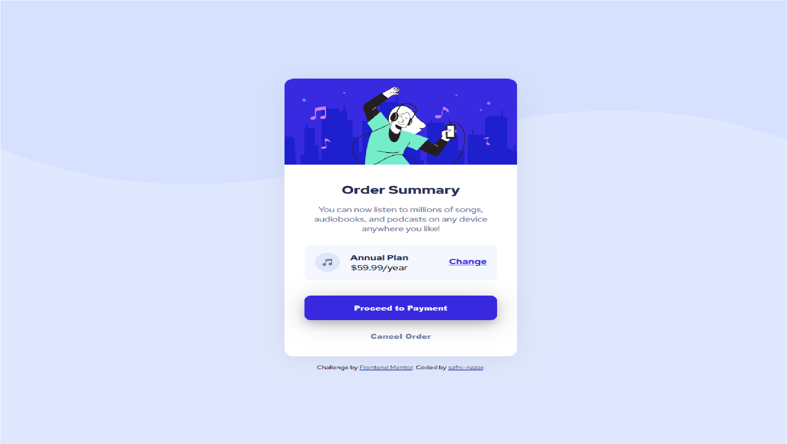

# Frontend Mentor - Order summary card solution

This is a solution to the [Order summary card challenge on Frontend Mentor](https://www.frontendmentor.io/challenges/order-summary-component-QlPmajDUj). Frontend Mentor challenges help you improve your coding skills by building realistic projects. 

## Overview

### Screenshot



### Links

- Live Site URL: [url](https://shafni50.github.io/ordersummarycard/)

## My process

### Built with

- HTML5 markup
- CSS 
- Flexbox
- Desktop-first workflow


```html
<h1>I'm proud of myself😌❤</h1>
```

## Author

- Website - [Safni Nazar](https://linktr.ee/shafni50)
- Frontend Mentor - [@shafni50](https://www.frontendmentor.io/profile/shafni50)
