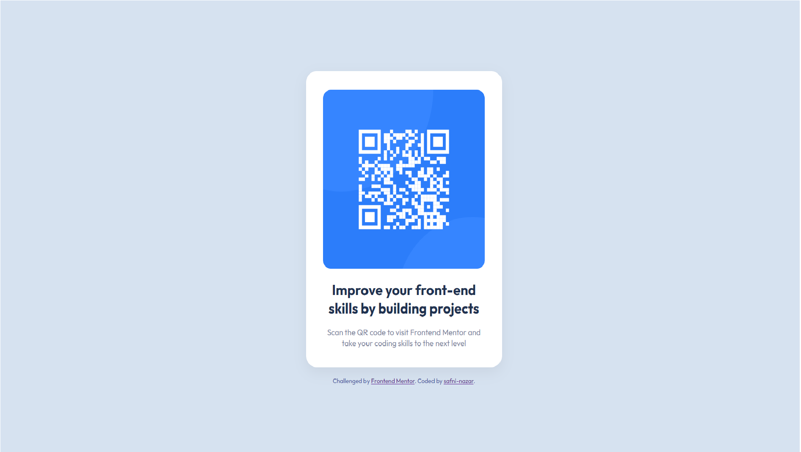

# Frontend Mentor - QR code component solution

This is a solution to the [QR code component challenge on Frontend Mentor](https://www.frontendmentor.io/challenges/qr-code-component-iux_sIO_H). Frontend Mentor challenges help you improve your coding skills by building realistic projects. 

### Screenshot




- Live Site URL: [url](https://shafni50.github.io/qrcardcomponent/)


### Built with

- Semantic HTML5 markup
- CSS custom properties
- Flexbox

```html
<h1>I'm proud of myself!</h1>
```
```css
.proud-of-this-css {
  color: none;
}
```
```js
const proudOfThisFunc = () => {
  console.log('😌❤')
}
```

## Author

-Website - [Safni Nazar](https://linktr.ee/shafni50)
-Frontend Mentor - [@shafni50](https://www.frontendmentor.io/profile/shafni50)
